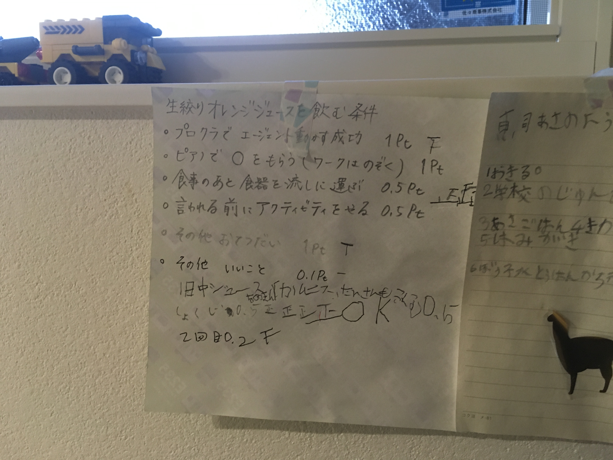
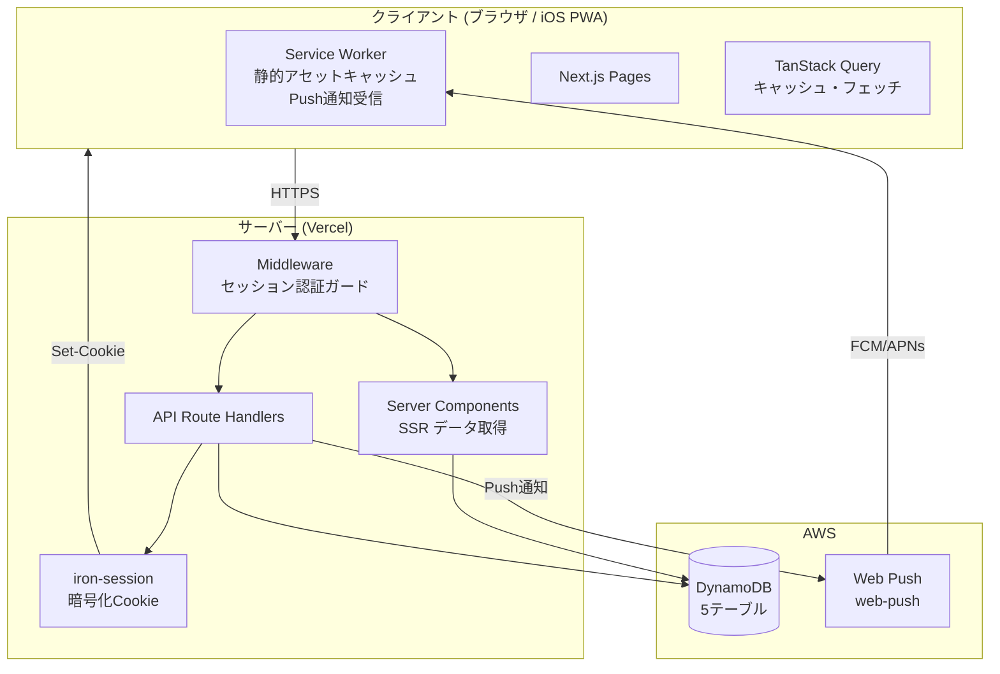
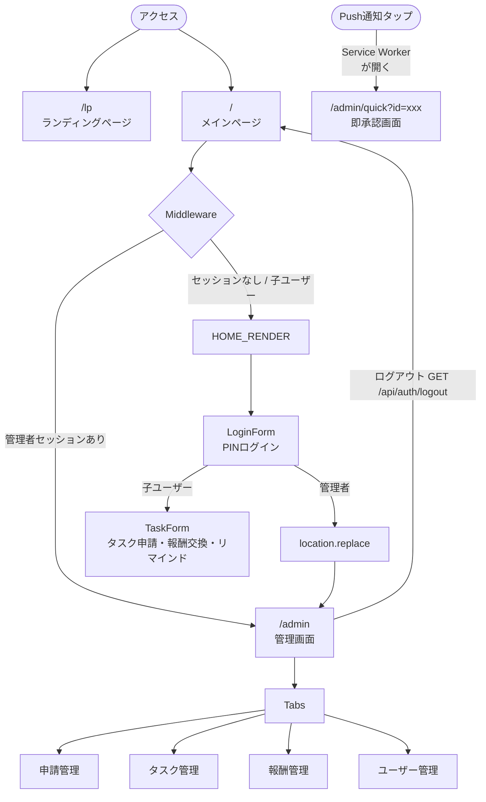
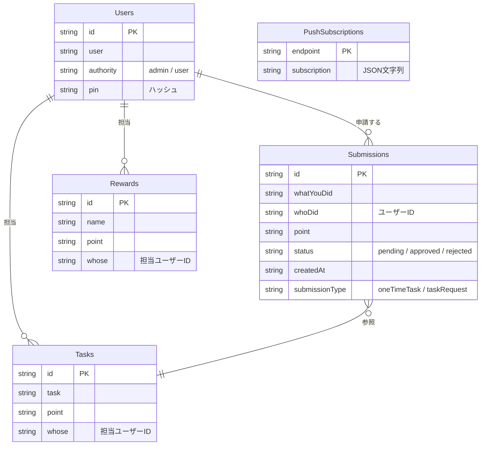
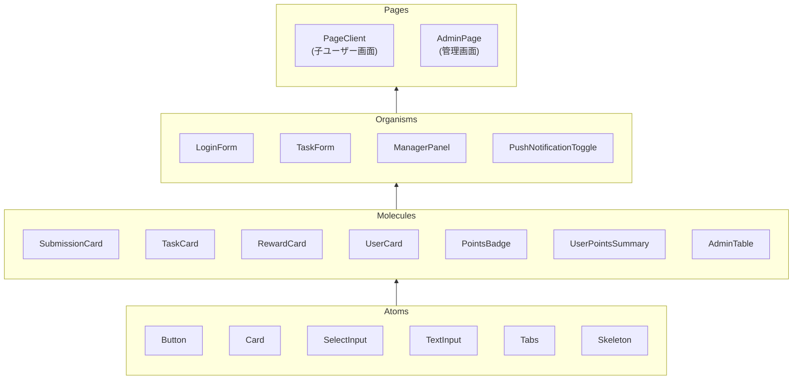
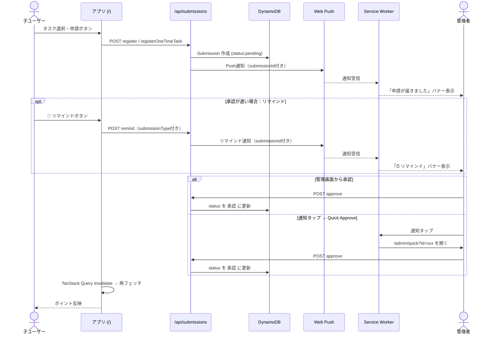
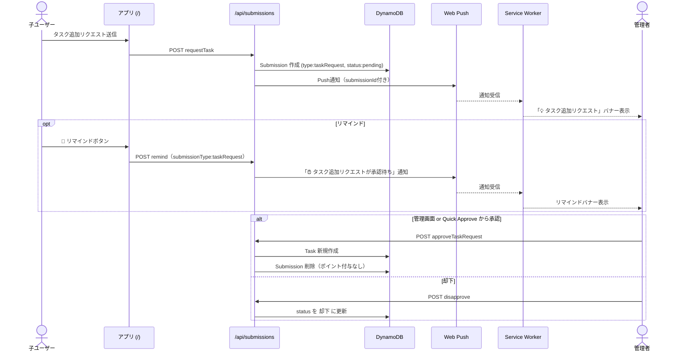
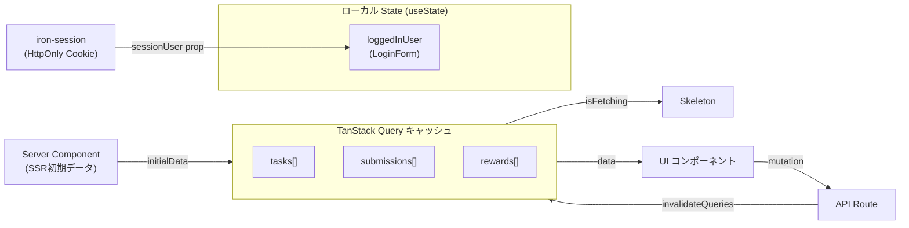

# ポイント管理アプリ

家族でお手伝いタスクをこなしてポイントを貯め、好きな報酬と交換できる家族向けポイント管理アプリです。

## 開発の背景

近所のスーパーに[IJOOZ](https://www.ijooz.com/media)という生搾りオレンジジュースの自動販売機ができ、子供がどうしても飲みたいと言い始めたことがきっかけです。

「飲みたい」という純粋な動機を、ただお小遣いを渡すのではなく、お手伝いや家族への貢献と結びつけられないかと考えました。もともと紙に手書きで管理していたポイント制度をアプリ化することで、運用をスムーズにしつつ、子供が自分でお手伝いを見つけてポイントを申請できる仕組みにしました。



「タスク追加リクエスト」機能を設けたのもそのためです。親が決めたお手伝いをこなすだけでなく、子供自身が「これもお手伝いに入れてほしい」と提案できることで、自主的に家族の役に立つことを考えてほしいという意図があります。小さなジュース一杯のモチベーションが、家族みんなにとって良い習慣づくりにつながればと思っています。なお、報酬の内容や必要ポイントは自由に設定できるため、ジュースに限らず各家庭のご褒美に合わせて使えます。

## このアプリが目指す方向

お手伝いを口約束で管理していると、ポイントが曖昧になり、子供の頑張りが記録に残りません。「やったよ！」と言いに行くタイミングが合わなければそのまま流れてしまうし、何ポイント貯まったかも親も子もいつの間にか忘れてしまいます。

このアプリが解きたい問題は、**「子供の頑張りを、ちゃんと認めて記録する」** ことです。

子供が自分でお手伝いを申請し、親がそれを確認・承認する。このフローを通じて、頑張りが記録として残り、「自分はちゃんと見てもらえている」という実感が積み重なります。承認制にすることでポイントの信頼性を保ちつつ、自然に親子のコミュニケーションも生まれます。

ポイントを貯めて好きなご褒美と交換できるゴールを設けることで、モチベーションが続く仕組みを作っています。

## 機能

### 一般ユーザー
- **ログイン**: ユーザー選択 + PINコード認証（同一セッション内は自動ログイン）
- **タスク申請**: 担当タスクを選択してポイントを申請
- **一度きりタスク申請**: タスク一覧にないお手伝いを自由記述で申請（希望ポイントも指定可）
- **タスク追加リクエスト**: 一度きりタスク申請時に「タスクとして登録もリクエストする」でタスク追加を同時にリクエスト
- **報酬交換**: 貯まったポイントを担当報酬と交換

### 管理者（admin）
- **申請管理**: 申請の承認・却下・却下済み申請の復元・削除。一度きりタスクは承認時にポイントを編集可能
- **未使用ポイント集計**: ユーザー別の承認済みポイントを一覧表示。ポイントの編集・削除も可能（担当者名・ポイント数でソート対応）
- **タスクリクエスト管理**: ユーザーからのタスク追加リクエストを承認（タスクとして登録）・却下
- **タスク管理**: タスクの追加・編集・削除（担当ユーザー設定）
- **報酬管理**: 報酬アイテムの追加・編集・削除（担当ユーザー設定）
- **ユーザー管理**: ユーザーの追加・編集・削除（PIN・権限設定）

### 初回起動時
- ユーザーが0人の場合、初期設定画面を表示して最初の管理者アカウントを作成できる

## PWA（ホーム画面に追加して使う）

このアプリは **PWA（Progressive Web App）** として動作します。ホーム画面に追加すると、アプリのアイコンから起動でき、フルスクリーン表示・プッシュ通知など**ネイティブアプリに近い体験**が得られます。

> ブラウザからそのまま使うこともできますが、ホーム画面に追加することを強くおすすめします。

### iPhone / iPad（Safari）

1. Safari でアプリの URL を開く
2. 画面下部の **共有ボタン**（四角から矢印が出るアイコン）をタップ
3. 「**ホーム画面に追加**」をタップ
4. 名前を確認して「**追加**」をタップ
5. ホーム画面にアイコンが追加される

> **注意**: Chrome や Firefox では「ホーム画面に追加」が表示されないため、必ず **Safari** を使ってください。

### Android（Chrome）

1. Chrome でアプリの URL を開く
2. アドレスバー右の **⋮（メニュー）** をタップ
3. 「**ホーム画面に追加**」または「**アプリをインストール**」をタップ
4. 「**追加**」をタップ
5. ホーム画面にアイコンが追加される

### ホーム画面追加後にできること

| 機能 | 説明 |
|---|---|
| フルスクリーン起動 | ブラウザのUIなしで起動し、アプリらしい見た目になる |
| プッシュ通知（管理者） | お手伝い申請が届いたときに通知を受け取れる |
| ホーム画面アイコン | ブックマークより素早くアクセスできる |

## Storybook

UIコンポーネントのカタログは GitHub Pages で公開しています。

- **Storybook**: [https://yujiooya.github.io/juice-point/](https://yujioya.github.io/juice-point/?path=/docs/admin-rewardmanagerclient--docs)

## 技術スタック

- **フレームワーク**: [Next.js](https://nextjs.org/) 16 (App Router)
- **言語**: TypeScript
- **データベース**: Amazon DynamoDB
- **デプロイ**: Vercel
- **認証**: Vercel OIDC + AWS IAM Role
- **状態管理**: TanStack Query v5（サーバーデータのキャッシュ・ミューテーション管理）
- **通知**: sonner（トースト）
- **PWA**: Service Worker（静的アセットキャッシュ・プッシュ通知）

## DynamoDB テーブル構成

### TABLE_MASTER_USER（ユーザー）

| フィールド  | 型     | 説明                          |
|------------|--------|-------------------------------|
| id         | String | パーティションキー              |
| user       | String | ユーザー名                    |
| authority  | String | 権限（`admin` / `user`）      |
| pin        | String | ログイン用PINコード            |

### TABLE_MASTER_TASK（タスク）

| フィールド | 型     | 説明             |
|-----------|--------|------------------|
| id        | String | パーティションキー |
| task      | String | タスク名         |
| point     | String | 獲得ポイント     |
| whose     | String | 担当ユーザー名   |

### TABLE_SUBMISSIONS（申請）

| フィールド      | 型     | 説明                                                      |
|----------------|--------|-----------------------------------------------------------|
| id             | String | パーティションキー                                         |
| whatYouDid     | String | 実施したタスク名                                          |
| whoDid         | String | 実施者のユーザーID                                        |
| point          | String | ポイント数                                               |
| status         | String | `未承認` / `承認` / `却下`                               |
| createdAt      | String | 申請日時（ISO 8601形式）                                  |
| submissionType | String | 省略可。`oneTimeTask`（一度きりタスク）/ `taskRequest`（タスク追加リクエスト） |

### TABLE_MASTER_REWARD（報酬）

| フィールド | 型     | 説明               |
|-----------|--------|--------------------|
| id        | String | パーティションキー   |
| name      | String | 報酬名             |
| point     | String | 交換に必要なポイント |
| whose     | String | 担当ユーザー名     |

## セットアップ

### 前提条件

- Node.js 18 以上
- AWS CLI（[インストール方法](https://aws.amazon.com/cli/)）
- AWS アカウント（DynamoDB テーブル・IAM リソース作成権限が必要）

### 1. リポジトリのクローン

```bash
git clone <repository-url>
cd family-point-app
npm install
```

### 2. AWS インフラの構築

```bash
# AWS CLI の認証設定（未設定の場合）
aws configure

# インフラセットアップスクリプトを実行
./scripts/setup-aws.sh
```

以下を自動作成します：

| リソース | 内容 |
|---------|------|
| DynamoDB テーブル x4 | ユーザー・タスク・申請・報酬 |
| IAM ポリシー | DynamoDB 最小権限 |
| IAM ユーザー + アクセスキー | ローカル開発用 |
| IAM ロール（任意） | Vercel OIDC 用 |

### 3. 環境変数の設定

```bash
cp .env.example .env.local
```

`.env.local` にセットアップスクリプトの出力値を入力します。

```env
AWS_REGION=ap-northeast-1
AWS_ACCESS_KEY_ID=<setup-aws.sh の出力値>
AWS_SECRET_ACCESS_KEY=<setup-aws.sh の出力値>
TABLE_MASTER_USER=TABLE_MASTER_USER
TABLE_MASTER_TASK=TABLE_MASTER_TASK
TABLE_SUBMISSIONS=TABLE_SUBMISSIONS
TABLE_MASTER_REWARD=TABLE_MASTER_REWARD
```

> **Vercel 環境**では `AWS_ACCESS_KEY_ID` / `AWS_SECRET_ACCESS_KEY` の代わりに `AWS_ROLE_ARN`（OIDC）を使用します。

### 4. 開発サーバーの起動

```bash
npm run dev
```

[http://localhost:3000](http://localhost:3000) でアプリが起動します。ユーザーが 0 人の場合は初期設定画面が表示されるので、管理者名と PIN を入力して最初のアカウントを作成してください。

## Vercel へのデプロイ

Vercel CLI が必要です（`npm install -g vercel`）。`setup-aws.sh` で Vercel OIDC ロールを作成済みであることを確認してから実行します。

```bash
./scripts/setup-vercel.sh
```

以下を自動実行します：

1. Vercel へのログイン確認
2. プロジェクトのリンク（初回のみ）
3. `production` / `preview` / `development` 環境への環境変数一括設定

設定後は `vercel deploy` でデプロイできます。

## 費用の目安

### DynamoDB（On-Demand モード）

| 操作 | 単価（東京リージョン） |
|---|---|
| 読み取り 100万回あたり | $0.285 |
| 書き込み 100万回あたり | $1.425 |
| ストレージ | 25 GB まで無料 |

家族数人での利用では読み取り約1,800回・書き込み約200回/月程度のため、**月額数円〜数十円**の水準です。On-Demand モードには Provisioned モードのような無料枠（25 RCU/WCU）は適用されませんが、100万回を大きく下回る規模では実質ほぼ無料です。

### Vercel（Hobby プラン）

| 項目 | 無料枠 |
|---|---|
| Serverless Function 実行時間 | 100 GB-hours/月 |
| 帯域 | 100 GB/月 |
| デプロイ数 | 無制限 |
| カスタムドメイン | 1個 |

家族向けの個人利用であれば無料枠で十分です。ただし Hobby プランは**商用利用不可・チームメンバー1人まで**の制限があります。複数人でダッシュボードを管理したい場合は Pro プラン（$20/月）が必要です。

## ページ構成

| パス      | 説明                                                               |
|----------|--------------------------------------------------------------------|
| `/`      | メインページ（ログイン・タスク申請・報酬交換）。ユーザー0人の場合は初期設定画面 |
| `/admin` | 管理画面（申請管理・タスク管理・報酬管理・ユーザー管理）。管理者のみ     |
| `/admin/quick?id=xxx` | 通知タップからの即承認画面。管理者のみ |
| `/lp` | ランディングページ |

## 基本設計

### システム全体構成



### ページ構成と認証フロー



### データモデル（DynamoDB）



### コンポーネント設計（Atomic Design）



### タスク申請〜承認フロー



### タスク追加リクエストフロー



### 状態管理


